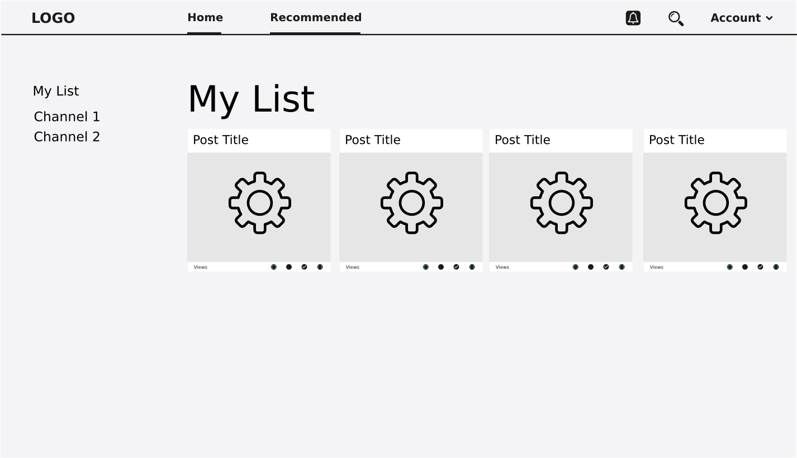

## SuyaBay Podcast App

Welcome to the SuyaBay Podcast repository on GitHub. Here you can browse the source, look at open issues and keep track of development.

[SuyaBay](https://www.suyabay.com) is a podcasting app built for suya lovers. Users can use the app either as a **guest** or a **registered user**. Being a registered user means a user has access to features such as **social integration features** (liking and sharing favorite episodes), which is not available to a guest user. A guest user can only have access to general episodes if available.

### Stack
      * PHP/Laravel

### Tools
      * Frontend - AngularJS, blade
      * Database - postgresql

### General overview:
The overview is presented from two perspectives. The perpective of a user of the app (front-end) and the perspective of an admin(owner of the podcasting service).

**frontend users should be able to:**
     
     1. Use SuyaBay as a guest. No registration/signin required.
     2. Use SuyaBay as a registered user. Registration/signin required.
     3. Have access to user dashboard:
     **_Registered users_**:
          - Should be able to subscribe/unsubscribe to channels and/or specific episodes
          - See list of subscribed channels
          - Have access to contact form
          - Have access to FAQs, About and Terms and conditions pages
          - Have access to other functionalities not yet implemented!
          
     **_Guest users_**:
          - Should be able to have access to only available(subscription not required) episodes
          - Have access to contact form
          - Have access to FAQs, About and Terms and conditions pages
          - Have option to register or remain as a guest user

**Admin users should be able to:**
     
     1. create/delete user roles.
     2. create/delete channels.
     3. upload/delete episodes
     

## FEATURES (MOCKUP)
1. User registration/login

2. User Dashboard

3. Watch Podcast

3. Contacts page

## Contributing to SuyaBay Podcast App
If you have an idea for SuyaBay Podcasting, feel free to suggest it in an [issue](https://www.github.com) on this repo.

## Supporting development
If you enjoy using SuyaBay Podcasting then please leave a [review](http://www.suyabay.com) to help promote continued development.
